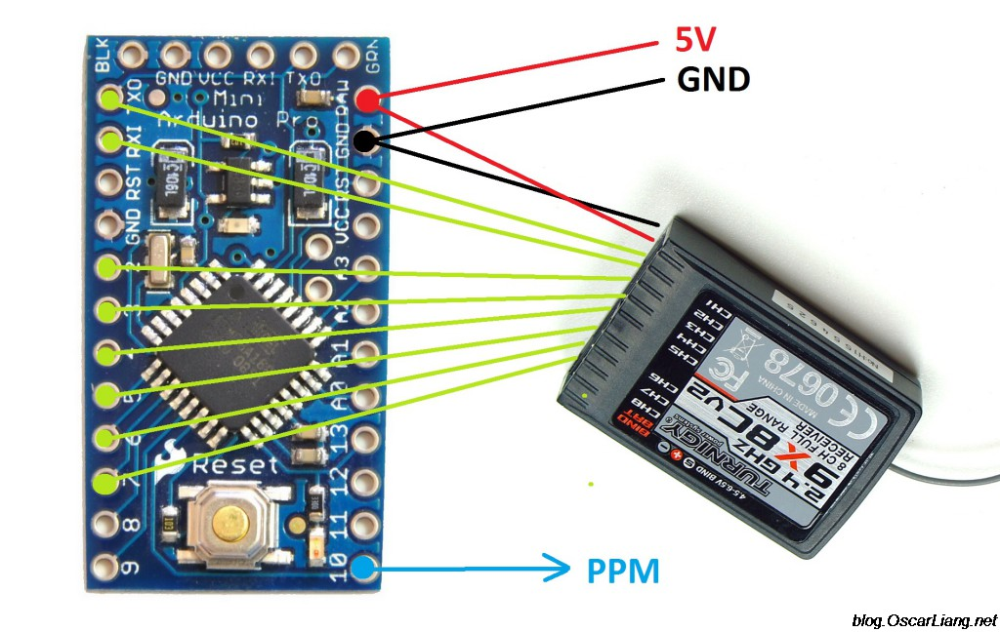
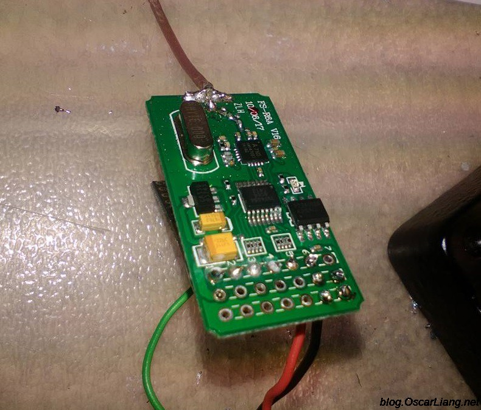
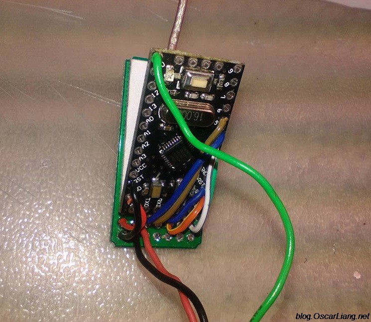

# Ardu-RC
The RC developments

## PWM 2 PPM
### Connection
The connection is really simple.

5V and GND on receiver is connected to “RAW” and GND pins on the Arduino board. Ch1 to Ch8 is connected D0 to D7 on the Arduino. (if you are using receiver that has fewer channels, you don’t have to worry about the rest of the pins on the Arduino)

For a more detail connection diagram, check out the top picture in this article.

pwm-ppm-converter-ardunio-rx-radio-receiver-back pwm-ppm-converter-ardunio-rx-radio-receiver-connection

He removed all the servo pins on this receiver, and soldered direct the arduino pwm to ppm converter. He said this has been running successfully for about 8 months, and i did the same conversion on an 8 channel receiver also has failsafe built in to the pwm ppm converter. Failsafe channel can be set up in the code.

There are 3 wires that will be connected to the FC, 5V, GND and PPM (Green).

And finally he put heatshrink over this unit, and now this cheap PWM RX has turned into a powerful PPM RX :) He put clear heatshrink in the middle so he could see the status LEDs.
